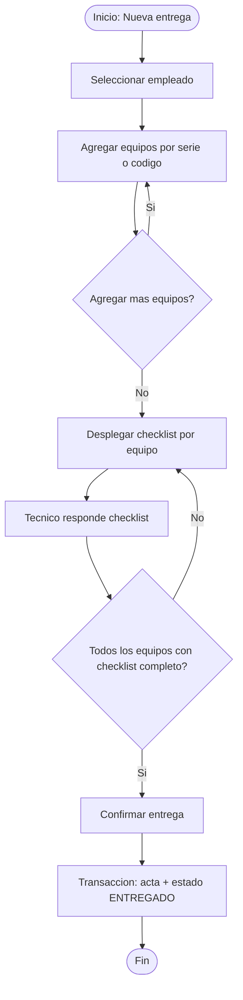
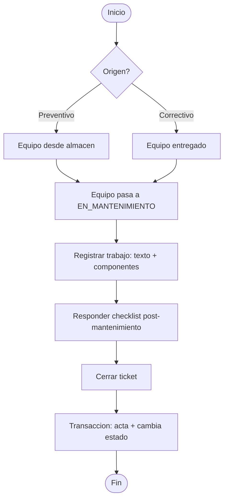
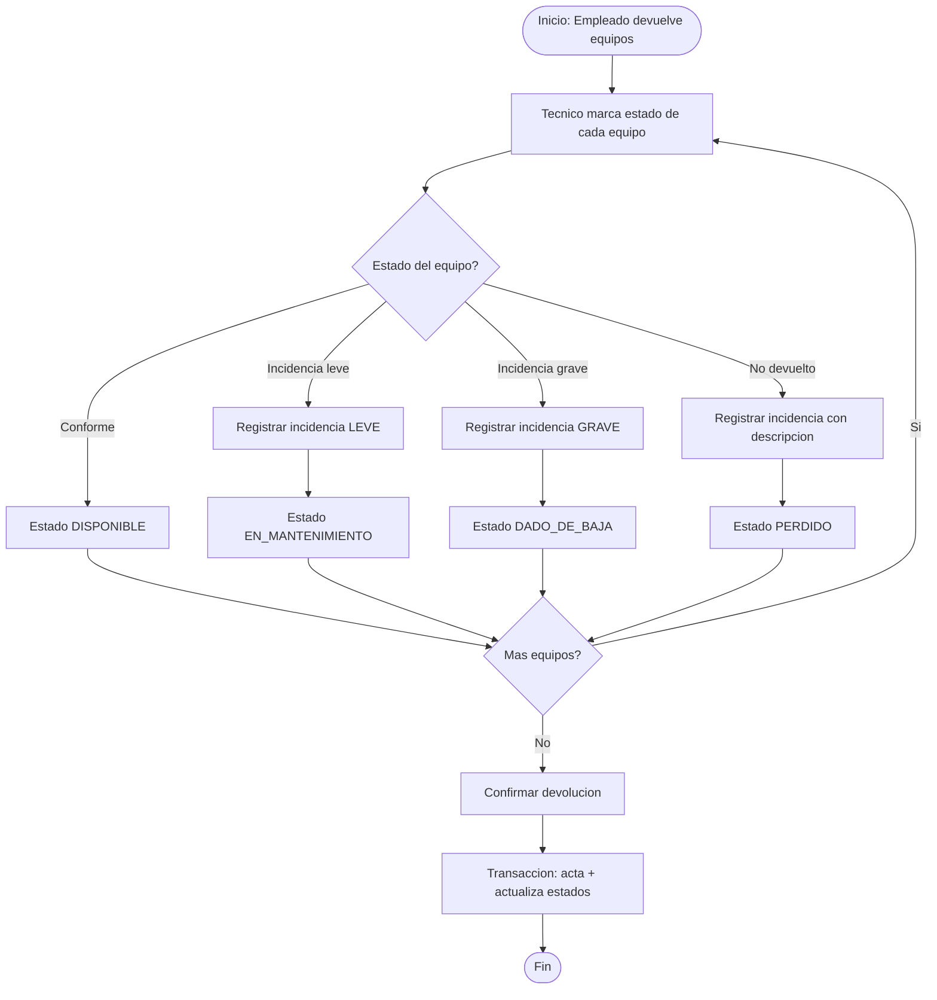
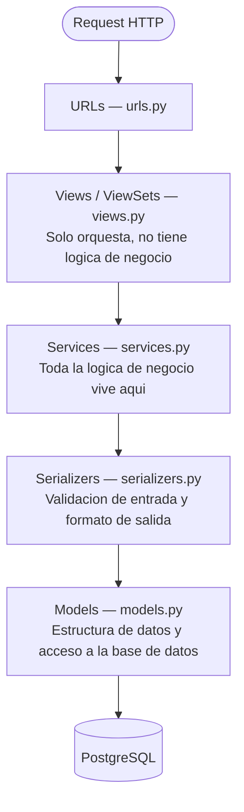
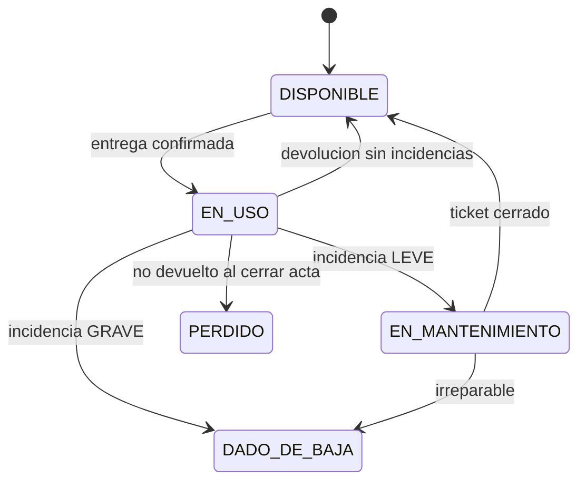

# Diseño del sistema — EquipManager

## El problema

El área de Sistemas manejaba equipos electrónicos completamente en Excel. Cada acta era un archivo separado, no había historial, no había trazabilidad, no había inventario en tiempo real.

## La solución

Una REST API con tres flujos principales que reemplaza el proceso manual por uno digital, trazable y con evidencia en actas generadas automáticamente.

---

## Flujo 1 — Entrega de equipos

## Flujo 2 — Mantenimiento

**Regla crítica:** sin ticket cerrado con descripción, el sistema no permite cambiar el estado del equipo.

## Flujo 3 — Devolución

---

## Arquitectura en capas

El proyecto usa una arquitectura en capas. Cada capa tiene una responsabilidad única y no se mezcla con las demás.

### Responsabilidad de cada capa

| Capa | Archivo | Hace | No hace |
|---|---|---|---|
| URLs | `urls.py` | Enruta cada request al ViewSet correcto | Nada más |
| Views | `views.py` | Recibe el request, llama al Service, devuelve la respuesta | Lógica de negocio |
| Services | `services.py` | Genera actas, cambia estados, valida reglas de negocio | Acceso directo a HTTP |
| Serializers | `serializers.py` | Valida datos de entrada, formatea JSON de salida | Lógica de negocio |
| Models | `models.py` | Define tablas y relaciones, queries básicos | Lógica de negocio |

### Por qué Services y no lógica en las Views o los Models

Poner lógica en las Views las vuelve difíciles de testear y de reutilizar — un ViewSet está atado al ciclo HTTP. Poner lógica en los Models los convierte en clases que hacen demasiado (Fat Models). Los Services son clases o funciones Python puras, sin dependencia de HTTP ni de ORM, lo que las hace fáciles de testear unitariamente y reutilizables desde cualquier punto del sistema.

Ejemplo: cuando se confirma una entrega, el ViewSet no genera el acta ni cambia el estado de los equipos directamente. Solo llama a `AsignacionService.confirmar_entrega(asignacion_id)`, que internamente ejecuta la transacción completa.

---

## Estados de un equipo

### Descripcion de cada estado

| Estado | Significa |
|---|---|
| DISPONIBLE | En almacen, listo para entregarse |
| EN_USO | Con un empleado actualmente |
| EN_MANTENIMIENTO | En taller, fuera de servicio temporalmente |
| DADO_DE_BAJA | Irreparable o descartado definitivamente |
| PERDIDO | Entregado a un empleado y no fue devuelto |
