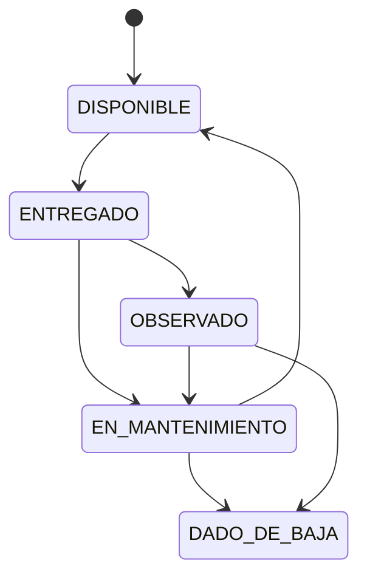

# Diseño del sistema — EquipManager

## El problema

El área de Sistemas manejaba equipos electrónicos completamente en Excel. Cada acta era un archivo separado, no había historial, no había trazabilidad, no había inventario en tiempo real.

## La solución

Una REST API con tres flujos principales que reemplaza el proceso manual por uno digital, trazable y con evidencia automática.

---

## Flujo 1 — Entrega de equipos

```mermaid
flowchart TD
    A([Inicio: Nueva entrega]) --> B[Seleccionar empleado]
    B --> C[Agregar equipos por serie/código]
    C --> D{¿Agregar más equipos?}
    D -->|Sí| C
    D -->|No| E[Desplegar checklist por equipo]
    E --> F[ Técnico responde checklist]
    F --> G{¿Todos los equipos checklist completo?}
    G -->|No| E
    G -->|Sí| H[Confirmar entrega]
    H --> I[\"Transacción: genera acta + estado ENTREGADO + correo/\"]
    I --> J([Fin])
```

## Flujo 2 — Mantenimiento

```mermaid
flowchart TD
    A([Inicio]) --> B{¿Origen?}
    B -->|Preventivo| C[Equipo desde almacén]
    B -->|Correctivo| D[Equipo entregado]
    C --> E[\"Equipo → EN_MANTENIMIENTO + correo usuario\"]
    D --> E
    E --> F[Registrar trabajo: texto + componentes]
    F --> G[Responder checklist post-mantenimiento]
    G --> H[Cerrar ticket]
    H --> I[\"Transacción: genera acta + cambia estado + correo\"]
    I --> J([Fin])
```

**Regla crítica:** sin ticket cerrado con descripción, el sistema no permite cambiar el estado del equipo.

## Flujo 3 — Devolución

```mermaid
flowchart TD
    A([Inicio: Empleado devuelve equipo]) --> B[Completar checklist de recepción]
    B --> C[Comparar con checklist de entrega]
    C --> D{¿Todo en orden?}
    D -->|Sí| E[\"Estado DISPONIBLE + genera acta + correo\"]
    D -->|No| F{¿Daño?}
    F -->|Leve| G[Registrar incidencia LEVE]
    G --> H[Estado EN_MANTENIMIENTO]
    F -->|Grave| I[Registrar incidencia GRAVE]
    I --> J[Estado DADO_DE_BAJA]
    E --> K([Fin])
    H --> K
    J --> K
```

---

## Arquitectura en capas

El proyecto usa una arquitectura en capas. Cada capa tiene una responsabilidad única y no se mezcla con las demás.


### Responsabilidad de cada capa

| Capa | Archivo | Hace | No hace |
|---|---|---|---|
| URLs | `urls.py` | Enruta cada request al ViewSet correcto | Nada más |
| Views | `views.py` | Recibe el request, llama al Service, devuelve la respuesta | Lógica de negocio |
| Services | `services.py` | Genera actas, cambia estados, envía correos, valida reglas de negocio | Acceso directo a HTTP |
| Serializers | `serializers.py` | Valida datos de entrada, formatea JSON de salida | Lógica de negocio |
| Models | `models.py` | Define tablas y relaciones, queries básicos | Lógica de negocio |

### Por qué Services y no lógica en las Views o los Models

Poner lógica en las Views las vuelve difíciles de testear y de reutilizar — un ViewSet está atado al ciclo HTTP. Poner lógica en los Models los convierte en clases que hacen demasiado (Fat Models). Los Services son clases o funciones Python puras, sin dependencia de HTTP ni de ORM, lo que las hace fáciles de testear unitariamente y reutilizables desde cualquier punto del sistema.

Ejemplo: cuando se confirma una entrega, el ViewSet no genera el acta ni envía el correo. Solo llama a `AsignacionService.confirmar_entrega(asignacion_id)`, que internamente ejecuta la transacción completa.

---

## Estados de un equipo



---