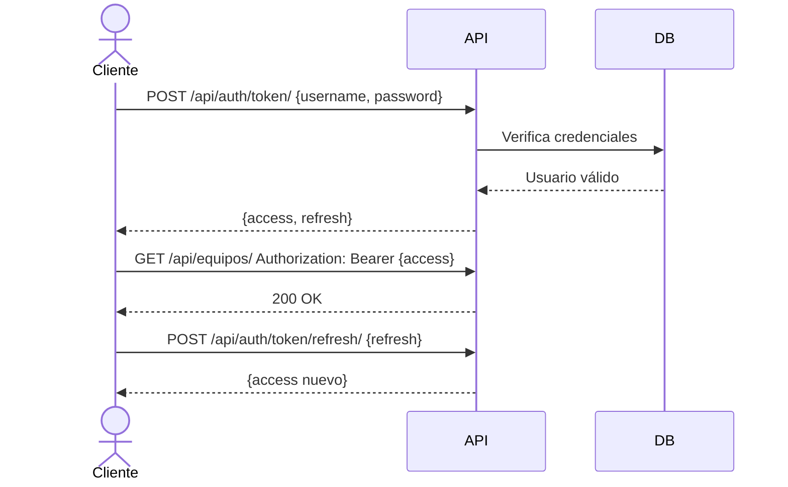
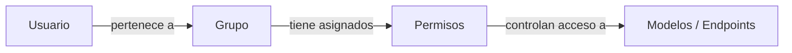

# Autenticación y permisos — EquipManager

## Autenticación

EquipManager usa JWT mediante `djangorestframework-simplejwt`. Todos los endpoints requieren un token válido en el header, excepto los de obtención de token.

### Flujo



### Endpoints de autenticación

| Método | Ruta | Descripción |
|--------|------|-------------|
| POST | `/api/auth/token/` | Obtener access + refresh token |
| POST | `/api/auth/token/refresh/` | Renovar access token con el refresh |
| POST | `/api/auth/token/verify/` | Verificar si un token es válido |

### Vida de los tokens

| Token | Duración | Qué hacer cuando expira |
|-------|----------|-------------------------|
| Access | 1 hora | Usar el refresh token para obtener uno nuevo |
| Refresh | 7 días | El usuario debe volver a hacer login |

---

## Permisos

EquipManager usa el sistema nativo de **Groups y Permissions de Django**. No hay roles hardcodeados en el código.

### Por qué este enfoque

Django genera automáticamente 4 permisos por cada modelo: `add`, `change`, `delete`, `view`. Estos permisos se asignan a grupos, y los grupos se asignan a usuarios desde el Django Admin. Esto significa que no es necesario programar un sistema de roles — ya existe y es más flexible que uno personalizado.

### Cómo funciona



1. El administrador crea un grupo en Django Admin (ej: `Técnicos`, `Soporte`)
2. Le asigna los permisos que ese grupo puede ejecutar
3. Asigna usuarios a ese grupo
4. La API verifica automáticamente si el usuario tiene el permiso requerido antes de ejecutar cada acción

### Cómo se protege un endpoint en el código

Cada ViewSet declara los permisos que requiere. Django se encarga de verificarlos:

```python
# Ejemplo en un ViewSet
permission_classes = [IsAuthenticated, DjangoModelPermissions]
```

Con `DjangoModelPermissions`, Django mapea automáticamente:

| Método HTTP | Permiso requerido |
|-------------|-------------------|
| GET | `view_<modelo>` |
| POST | `add_<modelo>` |
| PUT / PATCH | `change_<modelo>` |
| DELETE | `delete_<modelo>` |

### Gestión de usuarios

La creación y administración de usuarios se hace desde el **Django Admin** (`/admin/`). Solo los usuarios con `is_staff = True` tienen acceso al admin. No existe un endpoint público para registrar usuarios — el acceso al sistema lo otorga el administrador.
