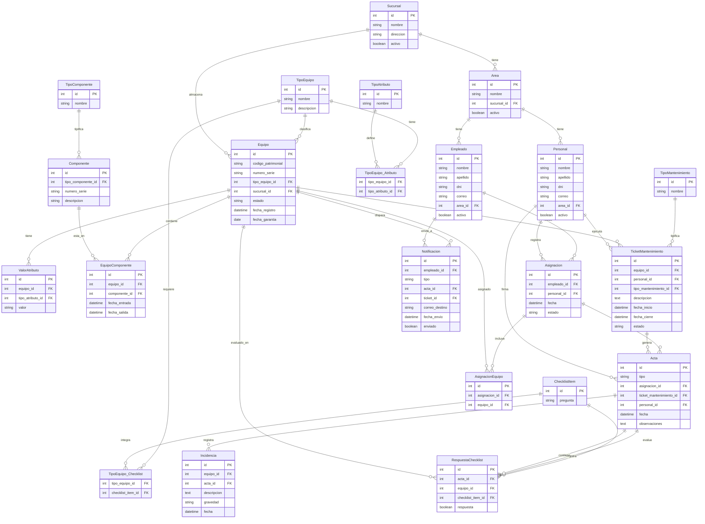

# Modelo de datos — EquipManager

## Tablas y relaciones

```mermaid
erDiagram
    Sucursal ||--o{ Area : tiene
    Area ||--o{ Personal : tiene
    Area ||--o{ Empleado : tiene
    
    Sucursal {
        int id PK
        string nombre
        string direccion
        boolean activo
    }
    
    Area {
        int id PK
        string nombre
        int sucursal_id FK
        boolean activo
    }
    
    Personal {
        int id PK
        string nombre
        string apellido
        string dni
        string correo
        int area_id FK
        boolean activo
    }
    
    Empleado {
        int id PK
        string nombre
        string apellido
        string dni
        string correo
        int area_id FK
        boolean activo
    }
    
    TipoEquipo ||--o{ Equipo : clasifica
    Sucursal ||--o{ Equipo : almacena
    TipoEquipo ||--o{ TipoEquipo_Atributo : tiene
    TipoAtributo ||--o{ TipoEquipo_Atributo : define
    Equipo ||--o{ ValorAtributo : tiene
    Equipo ||--o{ EquipoComponente : contiene
    
    TipoEquipo {
        int id PK
        string nombre
        string descripcion
    }
    
    TipoAtributo {
        int id PK
        string nombre
    }
    
    TipoEquipo_Atributo {
        int tipo_equipo_id FK
        int tipo_atributo_id FK
    }
    
    ValorAtributo {
        int id PK
        int equipo_id FK
        int tipo_atributo_id FK
        string valor
    }
    
    Equipo {
        int id PK
        string codigo_patrimonial
        string numero_serie
        int tipo_equipo_id FK
        int sucursal_id FK
        string estado
        datetime fecha_registro
        date fecha_garantia
    }
    
    TipoComponente ||--o{ Componente : tipifica
    Componente ||--o{ EquipoComponente : esta_en
    
    TipoComponente {
        int id PK
        string nombre
    }
    
    Componente {
        int id PK
        int tipo_componente_id FK
        string numero_serie
        string descripcion
    }
    
    EquipoComponente {
        int id PK
        int equipo_id FK
        int componente_id FK
        datetime fecha_entrada
        datetime fecha_salida
    }
    
    TipoEquipo ||--o{ TipoEquipo_Checklist : requiere
    ChecklistItem ||--o{ TipoEquipo_Checklist : integra
    ChecklistItem ||--o{ RespuestaChecklist : evalua
    Acta ||--o{ RespuestaChecklist : registra
    
    ChecklistItem {
        int id PK
        string pregunta
    }
    
    TipoEquipo_Checklist {
        int tipo_equipo_id FK
        int checklist_item_id FK
    }
    
    Empleado ||--o{ Asignacion : recibe
    Personal ||--o{ Asignacion : registra
    Asignacion ||--o{ AsignacionEquipo : incluye
    Equipo ||--o{ AsignacionEquipo : asignado
    
    Asignacion {
        int id PK
        int empleado_id FK
        int personal_id FK
        datetime fecha
        string estado
    }
    
    AsignacionEquipo {
        int id PK
        int asignacion_id FK
        int equipo_id FK
    }
    
    TipoMantenimiento ||--o{ TicketMantenimiento : tipifica
    Equipo ||--o{ TicketMantenimiento : recibe
    Personal ||--o{ TicketMantenimiento : ejecuta
    
    TipoMantenimiento {
        int id PK
        string nombre
    }
    
    TicketMantenimiento {
        int id PK
        int equipo_id FK
        int personal_id FK
        int tipo_mantenimiento_id FK
        text descripcion
        datetime fecha_inicio
        datetime fecha_cierre
        string estado
    }
    
    Asignacion ||--o{ Acta : genera
    TicketMantenimiento ||--o{ Acta : genera
    Personal ||--o{ Acta : firma
    Acta ||--o{ Incidencia : registra
    Acta ||--o{ RespuestaChecklist : contiene
    Equipo ||--o{ RespuestaChecklist : evaluado_en
    
    Acta {
        int id PK
        string tipo
        int asignacion_id FK
        int ticket_mantenimiento_id FK
        int personal_id FK
        datetime fecha
        text observaciones
    }
    
    RespuestaChecklist {
        int id PK
        int acta_id FK
        int equipo_id FK
        int checklist_item_id FK
        boolean respuesta
    }
    
    Incidencia {
        int id PK
        int equipo_id FK
        int acta_id FK
        text descripcion
        string gravedad
        datetime fecha
    }
    
    Equipo ||--o{ Notificacion : dispara
    Empleado ||--o{ Notificacion : envia_a
    
    Notificacion {
        int id PK
        int empleado_id FK
        string tipo
        int acta_id FK
        int ticket_id FK
        string correo_destino
        datetime fecha_envio
        boolean enviado
    }
```

---