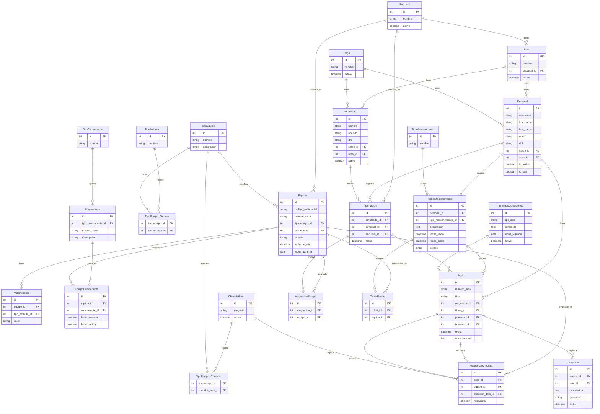

# Modelo de datos — EquipManager

## Tablas y relaciones

## Apps y sus modelos

### personal
`Cargo`, `Sucursal`, `Area`, `Personal` (AbstractUser), `Empleado`

### equipos
`TipoEquipo`, `TipoAtributo`, `TipoEquipo_Atributo`, `ValorAtributo`, `Equipo`, `TipoComponente`, `Componente`, `EquipoComponente`, `ChecklistItem`, `TipoEquipo_Checklist`

### asignaciones
`Asignacion`, `AsignacionEquipo`

### mantenimiento
`TipoMantenimiento`, `TicketMantenimiento`, `TicketEquipo`

**Choices de `TicketMantenimiento.estado`:** `ABIERTO`, `CERRADO`

**Choices de `Equipo.estado`:** `DISPONIBLE`, `ENTREGADO`, `EN_MANTENIMIENTO`, `OBSERVADO`, `DADO_DE_BAJA`, `PERDIDO`

**Choices de `Acta.tipo`:** `ENTREGA`, `DEVOLUCION`, `MANTENIMIENTO`

**Choices de `Incidencia.gravedad`:** `LEVE`, `GRAVE`

**Choices de `TerminosCondiciones.tipo_acta`:** `ENTREGA`, `DEVOLUCION`, `MANTENIMIENTO`

**Nota sobre `Acta`:** Una sola tabla cubre los tres tipos. `asignacion_id` y `ticket_id` son mutuamente excluyentes — uno siempre es null. El tipo `DEVOLUCION` referencia la misma `asignacion_id` que la `ENTREGA` original, lo que permite comparar el estado del equipo entre ambos momentos.

**Uso de `observaciones` por tipo de acta:**
- `ENTREGA` — detalles visuales preexistentes que el checklist no puede capturar con true/false. Ejemplo: *"Laptop con rajadura en puerto USB derecho, preexistente al momento de la entrega"*
- `DEVOLUCION` — contexto general del acta más allá de las incidencias por equipo. Ejemplo: *"Devolución por fin de contrato, pendiente trámite de mouse perdido"*
- `MANTENIMIENTO` — descripción de la solución aplicada. Ejemplo: *"Se reemplazó disco duro por SSD 512GB, instalación limpia de Windows 11 Pro"*

### actas
`TerminosCondiciones`, `Acta`, `RespuestaChecklist`, `Incidencia`
